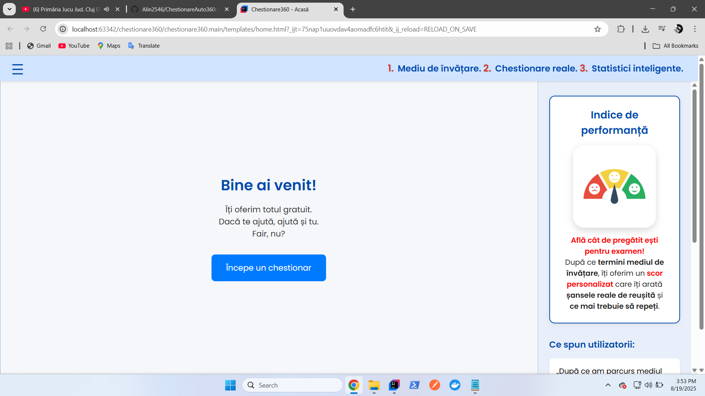
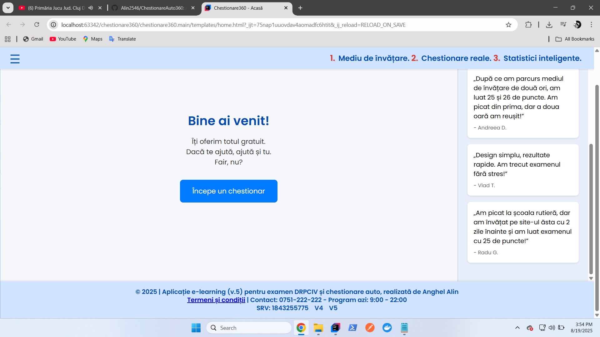
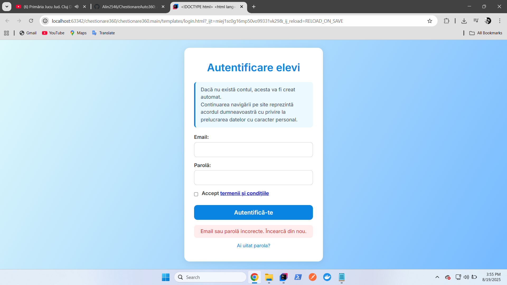
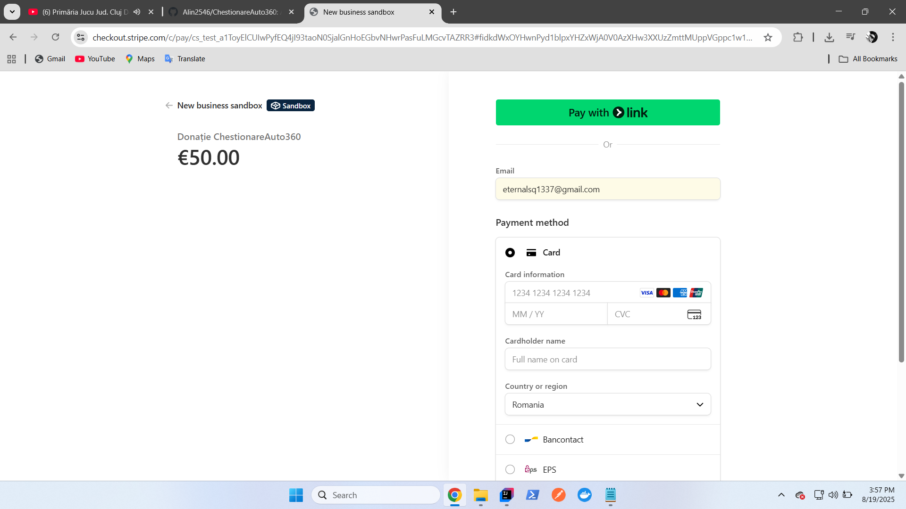

 ChestionareAuto360

🌐 [Youtube presentation for ChestionareAuto360](https://www.youtube.com/watch?v=8v7vW4NLC3g&t=1s)

ChestionareAuto360 is a web-based application designed to help learners prepare for the driving theory exam in Romania. It provides interactive quizzes and practice tests based on the official curriculum, helping users track their progress and improve their knowledge effectively.

Features

- User Authentication – Register or log in to save progress and access personalized quizzes

- Practice Tests & Quizzes – Complete multiple-choice questions that simulate the real exam

- Progress Tracking – Monitor your results and see improvement over time

- Exam Simulation – Realistic mock tests to prepare for the official driving theory exam

- Question Categories – Study by topic, including road signs, traffic rules, and safety regulations

- Instant Feedback – Get immediate results and explanations for each answer

-  Features – Access additional practice tests, offline mode, and more advanced statistics

Screenshots:

### Landing page
   

### Register / Login

### PayMethod

